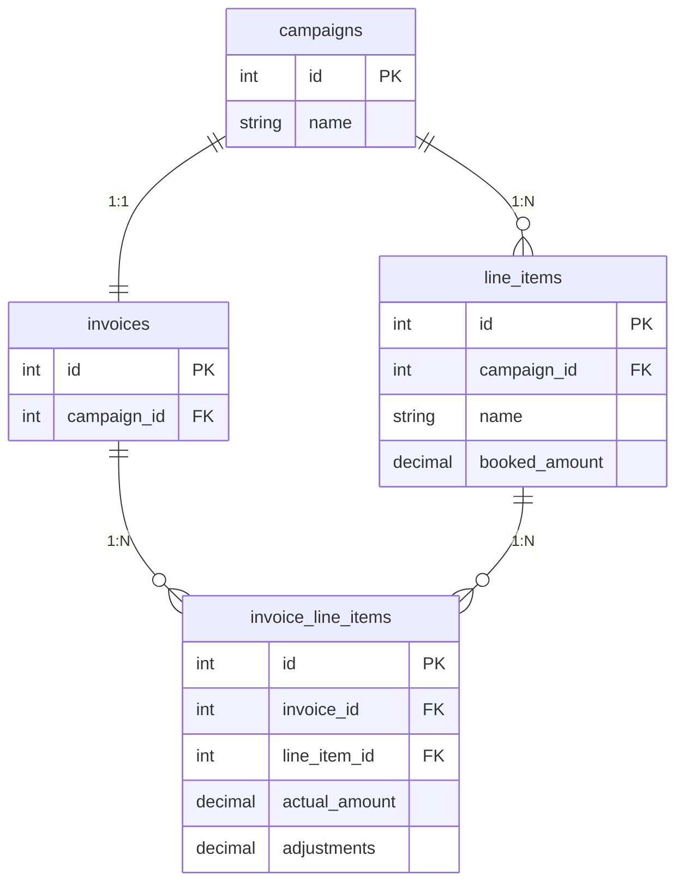

# Publisher Billing Lite

A full-stack application for managing publisher campaigns/orders and invoices with billing adjustments.

[](https://codecov.io/gh/ms0683436/publisher-billing-lite)

## Quick Start

Prerequisites: Docker Desktop

```bash
make up        # Start all services (API, Web, Worker, Database)
make seed      # Import seed data (campaigns, invoices, users)
```

Access the app at <http://localhost>

- API Docs: <http://localhost/api/docs>
- Login with any seeded user (e.g., `alice` / `password123`)

```bash
make down      # Stop all services
```

---

## Challenge Implementation

### Bucket 1: Core Features (All Completed)

#### Data Model & Seeding

Implemented a complete relational data model with full seed data import:

- **Campaign** - Publisher campaigns with name and associated line items
- **LineItem** - Individual ad placements with `booked_amount`
- **Invoice** - One-to-one with Campaign for billing
- **InvoiceLineItem** - Billing entries with `actual_amount` and editable `adjustments`

Seed data imports from JSON files via idempotent `make seed` command.

**Design decisions:**

- **Separate InvoiceLineItem table** - Decouples billing data from campaign data, allowing adjustment edits without touching source records.
- **Numeric(30,15) for money** - Matches the precision in seed data (`placements_teaser_data.json`) with headroom for higher-precision values. Calculations use raw values; rounded to 2 decimal places for display/edit.



#### Campaign Management

**List View** (`/campaigns`)

- Searchable by campaign name (case-insensitive `ILIKE` with GIN index)
- Sortable columns: ID, Name, Total Booked, Total Actual, Total Billable, Line Items Count
- Pagination support
- Invoice ID chip links to invoice detail page

**Detail View** (`/campaigns/:id`)

- Summary cards: Total Actual, Total Adjustments, Total Billable
- Expandable line items accordion (collapsed by default to keep commenting section visible)
- Integrated commenting section

#### Invoice Management

**List View** (`/invoices`)

- Searchable by campaign name (case-insensitive `ILIKE` with GIN index)
- Sortable columns: Invoice #, Campaign, Total Billable, Line Items
- Pagination support

**Detail View** (`/invoices/:id`)

- Summary cards with financial totals
- Line items table with all billing fields
- **Editable adjustments** with:
  - Inline editing with Edit/Save/Cancel controls
  - Decimal validation (2 decimal places)
  - Batch update API via `PATCH` (only sends changed values)
- Per-line-item change history access

**Design decision - Batch update API:**

Why batch instead of individual updates per line item?

- **Reduced network overhead** - Single round-trip instead of N requests for N line items
- **Better UX** - User edits multiple fields, then clicks "Save All" once, matching the mental model of "editing a form"

---

### Bucket 2: Advanced Features (2 Selected)

#### Change History

**Why I chose this:** Essential for any billing system - finance teams need complete audit trails. This also demonstrates async processing patterns for background work.

**Implementation highlights:**

- Tracks changes to: invoice line item adjustments, comment content edits
- Asynchronous processing via Procrastinate job queue
- Entity-level locking ensures sequential processing per entity
- JSONB storage for flexible old/new value comparison
- Timeline view showing: field changed, old value, new value, editor, timestamp

**Design decision - Async processing:**

Why process change history asynchronously instead of synchronously?

- **Non-blocking UX** - User's save operation returns immediately; audit logging happens in background
- **Eventual consistency is acceptable** - Audit logs don't need to be instantly visible; a few seconds delay is fine
- **Resilience** - If history processing fails, it can be retried without affecting the main operation

**Design decision - Procrastinate vs Celery vs Redis Queue:**

Already using PostgreSQL, so no additional infrastructure to maintain (unlike Celery which requires a separate broker). Jobs can be monitored with simple SQL queries. Trade-off: Redis Queue or Celery offers better throughput/latency, but not needed for audit log scale.

#### Commenting System with @Mentions

**Why I chose this:** Wanted to practice building this feature as I hadn't implemented @mention functionality before.

**Implementation highlights:**

- @mention autocomplete with user search
- Keyboard navigation (↑/↓ to navigate, Tab/Enter to select, Esc to close)
- Single-level reply threads
- Edit and delete own comments
- Mention extraction and notification triggering

**Design decision - Single-level replies:**

Why limit replies to one level instead of deeply nested threads?

- **Simpler UI** - Deeply nested threads become hard to read on narrow screens
- **Sufficient for use case** - Billing discussions rarely need deep threading; most comments are direct responses
- **Trade-off** - For complex discussions, users can @mention to reference earlier comments

---

### Bonus Features (Beyond Requirements)

#### JWT Authentication

**Why I chose this:** Once the commenting system was implemented with users, authentication became a natural requirement to identify who's commenting and control access.

**Implementation highlights:**

- Access token (15 min, stored in memory) + refresh token (7 days, HttpOnly cookie)
- Auto-refresh on 401 response
- Protected routes and API endpoints

**Design decision - JWT vs Session:**

Why JWT instead of session-based authentication?

- **Stateless** - No server-side session storage needed; token contains all user info
- **Scalable** - Works across multiple server instances without shared session store
- **API-friendly** - Natural fit for REST APIs; no cookie/CORS complexity for API calls
- **Trade-off** - Cannot revoke individual tokens immediately (must wait for expiry); mitigated by short access token lifetime

**Design decision - Access + Refresh tokens:**

Why use dual tokens instead of a single long-lived token?

- **Security** - Short-lived access tokens limit exposure if compromised
- **User experience** - Refresh tokens enable seamless re-authentication without login prompts
- **HttpOnly cookie** - Refresh token stored in HttpOnly cookie prevents XSS attacks from stealing it

#### Real-time Notifications

**Why I chose this:** Complements the commenting system by providing immediate feedback when users are mentioned or receive replies.

**Implementation highlights:**

- Server-Sent Events (SSE) for instant delivery
- Redis Queue for async notification processing
- Triggers on @mentions and comment replies
- Notification bell with unread badge
- Toast alerts and dedicated notifications page

**Design decision - SSE vs WebSocket:**

Why Server-Sent Events instead of WebSocket?

- **Simpler implementation** - SSE is HTTP-based, works through proxies without special config
- **Unidirectional is sufficient** - Notifications only flow server→client; no need for bidirectional
- **Auto-reconnect** - Browser handles reconnection automatically
- **Trade-off** - WebSocket would be needed for bidirectional features like live collaborative editing

**Design decision - Redis Queue vs Procrastinate:**

Why use Redis Queue instead of Procrastinate for notification processing?

- **Lower latency** - Redis provides near-instant message delivery, critical for real-time notifications
- **Better for short-lived tasks** - Notifications are one-off messages; we don't need the strict database storage or retry logic that Procrastinate offers
- **Trade-off** - Adds Redis as infrastructure dependency, but Redis can serve multiple purposes (caching, rate limiting, etc.)

---

## Tech Stack

### Backend (API)

- **Language:** Python 3.12
- **Framework:** FastAPI + Uvicorn
- **Why FastAPI:** Fast iteration, excellent typing support, auto-generated OpenAPI docs
- **Dependency tooling:** uv (reproducible installs via `uv.lock`)

### Frontend (Web)

- **Language:** TypeScript
- **Framework:** React (Vite)
- **UI:** MUI
- **Why this stack:** Strong developer ergonomics, fast HMR, accessible UI components out of the box
- **Package manager:** pnpm (fast, disk-efficient, lockfile for reproducibility)

### Background Processing

- **Change History:** Procrastinate (PostgreSQL-based) with entity-level locking
- **Notifications:** Redis Queue for low-latency real-time delivery

### Dev/Runtime

- Docker + Docker Compose (one-command startup)

---

## Development Commands

```bash
make up          # Start all services
make down        # Stop all services
make db-setup    # Run migrations + seed data
```

**Services started:** db (PostgreSQL), redis, api (FastAPI), web (React), nginx, notification-worker, change-history-worker

For database, linting, formatting, and testing commands, see `make help` or [Makefile](Makefile).

---

## Contributing

Install pre-commit hooks before committing:

```bash
uv run --project apps/api pre-commit install
```

Pre-commit hooks run automatically:

**On commit:**

- **Ruff format** - Python code formatting
- **Ruff check** - Python linting
- **Mypy** - Python type checking
- **ESLint** - TypeScript/React linting
